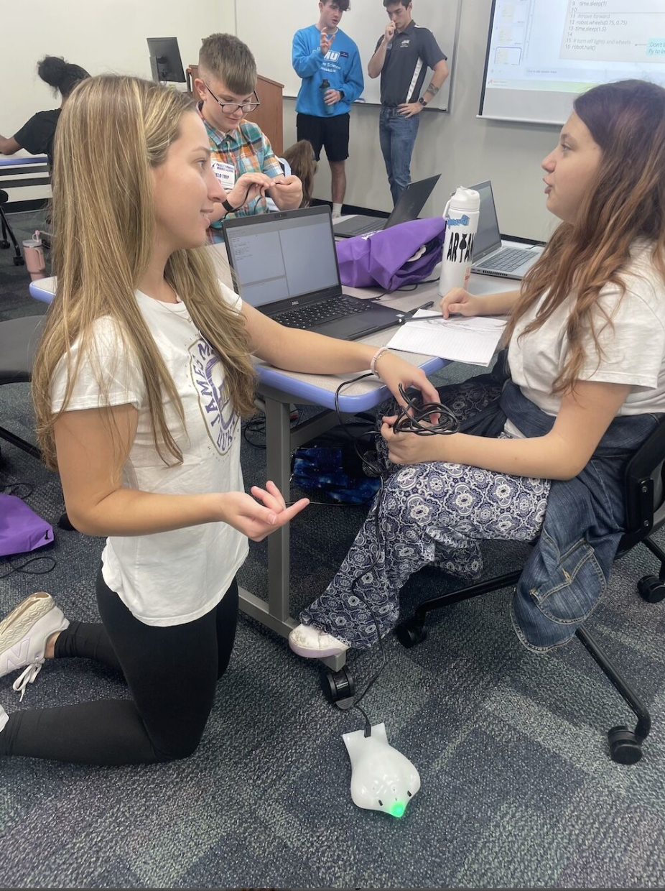

Mackenzie Rossiter
==================
Hi I'm Mackenzie!  After college, I plan to work in the EdTech industry where I can continue to make a difference at the intersection of Tech and Education.

## About Me

* Senior Computer Science Student at James Madison University
* Research Assisstant for AIMe, an AI powered math tutor for high schoolers
* AI Literacy & Professional Development Student Assistant 
* Lead CS Ambassador for JMU CS

# Education + Tech Work Experience

* Research Assistant - AIMe

    - James Madison University | May 2026 - Present

* Student Assistant, AI Literacy & Professional Development 

    - James Madison University | September 2026 - Present

* STEAM Specialist, 
    - Sunrise Day Camp | June 2025, 2026 - August 2025, 2026

* Lead CS Ambassador, Tour Coordinator
    - James Madison University |  August 2024 - Present

* Software Engineering Intern
    - BAE Systems | June 2024 - August 2024

* Computer Science Instructor
    - Self Employed | June 2026 - Present

# My Skills

### EdTech Tools 👩🏼‍💻👩🏼‍🏫

- Lego Education, Scratch, Dash and Dot Robots, GearBot, TinkerCad, Finch Robots, Ozo Bot, Microbit 

### Tech Tools 🛠️

- Langfuse, LiteLLM, Git, Visual Studio Code, Bitbucket, Docker, Jira, Microsoft Office 365, Google Suite

### AI Literacy Certifications 🤖

- Anthropic Claude Code 101, Anthropic AI Fluency for Student

### Languages 💻

- JavaScript, HTML, CSS, Python, Java, C, R

STEM Outreach
=============

 

Throughout college I have strived to find opportunities that allow me to share my passion for tech while giving back to a community thats so important to me.  Above are photos of me teaching kids, K-12, various STEM lessons.  

Mackenzie Rossiter
==================

[GitHub](https://github.com/mackenzierossiter) [LinkedIn](https://www.linkedin.com/in/mackenzie-rossiter/)

All rights reserved by Mackenzie Rossiter - 2025