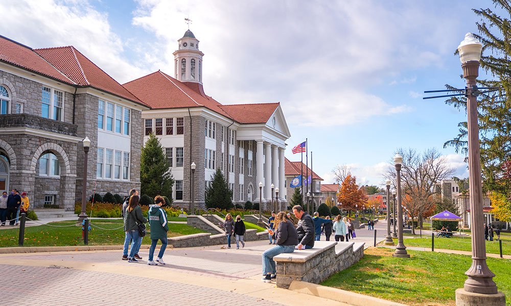
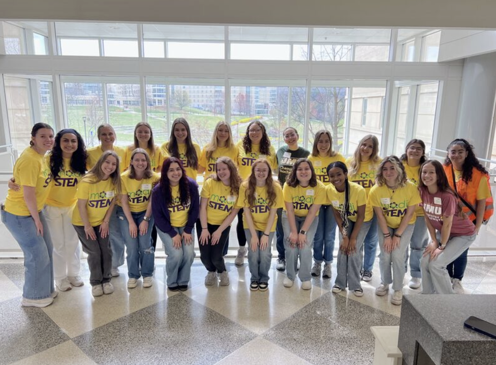
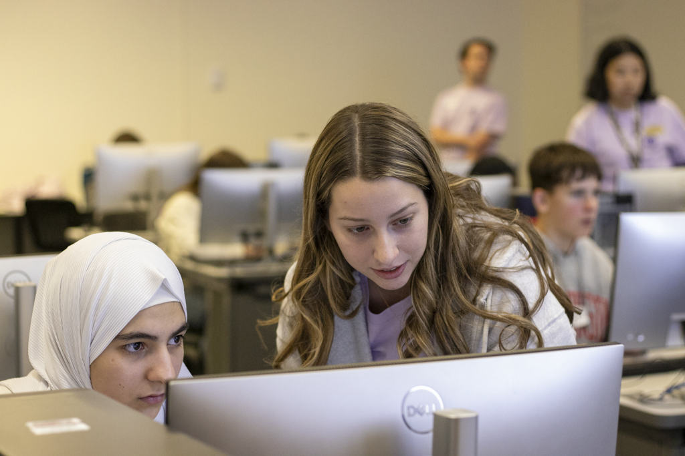

  Mackenzie Rossiter  

Mackenzie Rossiter
==================

## Overview

* Senior Computer Science Student at James Madison University
* Interested in EdTech
* Research Assisstant for AIMe, an AI powered math tutor for high schoolers
* AI Literacy & Professional Development Student Assistant 
* Lead CS Ambassador for JMU CS

  

### Relevant Coursework

Computer Systems II, Computer Systems I, Discrete Structures II, Discrete Structures I, Software Engineering, Algorithms and Data Structures, Advanced Programming, Intro to Programming, Intro to Probability and Statistics, Calculus II, Information in Contemporary Societey, Critical Questions in Education, Psychology: Life Span of Human Development

My Skills
=========

Languages
---------

Python, Java, C, JavaScript, R, HTML, CSS

Tools
-----

Bitbucket, Git, Visual Studio Code, Jira, Docker, Microsoft Office 365, Google Suite

Software Development
--------------------

Agile (Scrum), Object Oriented Program, Test-Driven Development

Work Experience
===============

Software Engineering Intern
---------------------------

### BAE Systems | June 2024 - August 2024

As a Software Engineering Intern for BAE Systems, I worked on three main projects. The Pull Request Tool, the Turnover Tool, and improving the Women in Tech program materials. With the Pull Request Tool, I used the BitBucket REST API to display git pull request information for each repository and their respective sub-repositories. I used Docker to allow for an easier development and deployment experience. This tool completed a task that used to take 2 hours, take 5 minutes. For the Turnover Tool, I created a list of changes and fixes needed to make the web app more efficient and usable. My work for the WiT program included researching new materials like arduinos boards, receivers, sensors and more to make the program more effective for students. I then presented my findings to the leader of the WiT program.

  
  

Lead CS Ambassador
------------------

### James Madison University | August 2024 - Current

My specific position as a Lead CS Ambassador is tour coordinator. This means I communicate with prospective students, their families, and my fellow CS Ambassadors to arrange tours for students interested in becoming a part of the JMU CS department. In addition, I organize all tours of the department during JMU’s open house and admitted students day. As an ambassador, I meet weekly with a team of 12 to plan professional, social, and academic events for all students in the CS department. This includes events like Game Night, duck decorating, career fair preparation workshops and more.

  
  

STEAM Specialist
----------------

### Sunrise Day Camp | June 2025 - August 2025

Sunrise Day Camp is the only full summer day camp offered to kids with cancer and their siblings free of charge. As the STEAM Specialist, I work in the STEAM shack teaching kids ages 3-16 coding, robotics, 3D printing and more. While at Sunrise, I quickly had to change my lesson plans to meet different language, learning and medical needs. This job taught me how to quickly adapt to my surroundings and the importance of STEM being accessible to every student.

  
  

Code Coach
----------

### The Coder School | January 2022 - July 2023

As a Code Coach, I taught students aged 8 - 14 Scratch and Python. I would program games and teach those games to students as part of my weekly lesson plan. Along the way students learned basic computer science concepts like loops, conditional statements, events and more. I taught students how to create many different games, from fruit ninja to guess the number. This position taught me the importance of classroom management, collaboration with coworkers and student centered instruction.

Projects
========

Duck Hunt
---------

[GitHub](https://github.com/mackenzierossiter/CS345_F24)

### JavaScript | August 2024 - December 2024

*   Directed a 5-person team to design a game in p5.js, facilitating progress tracking and problem-solving
*   Adapted to obstacles and challenges by utilizing Agile techniques and Scrum framework
*   Presented potentially shippable product increment every week to the professor

  
  

AOE Point Calculator
--------------------

[GitHub](https://github.com/alicmc/aoePointApp)

### React JS | December 2025 - January 2026

*   Worked in a team of 2 to design and implement a point tracker for over 100 members of Alpha Omega Epsilon Gamma Alpha Chapter to determine member status
*   Programmed a log in system using Google OAuth API restricting access to only 3 accounts
*   Designed a home page, login page and tables to ensure easy communication of data to the user

  
  

Y86-64 Interpreter
------------------

[GitHub](https://github.com/mackenzierossiter/Systems_y86_C_Project)

### C | February 2025 - May 2025

*   Implemented a Y86 instruction set interpreter, simulating a 6-stage von Neumann CPU architecture
*   Developed full instruction cycle support including branching, memory, arithmetic, and more
*   Handled instruction, pointer, and memory errors via CPU state codes

  
  

Multi-Processing & IPC
----------------------

[GitHub](https://github.com/mackenzierossiter/CS361_Project2)

### C | November 2025

*   Implemented a multi-process manufacturing simulation using fork()/exec, coordinating a Sales process, Supervisor, and multiple concurrent Factory processes.
*   Integrated inter-process communication with System V shared memory, message queues, and POSIX named semaphores to safely synchronize shared state, logging, and process rendezvous.
*   Built robust process lifecycle and signal-handling logic, including abnormal termination, critical-section protection, and final aggregated reporting.

  
  

MadZip Utility
--------------

[GitHub](https://github.com/mackenzierossiter/Data_Structures_Algorithms_Projects/tree/main/src/pas/huffman)

### Java | November 2024

*   Created a utility to compress and decompress files using a Huffman coding process
*   Ensured proper error handling with IOException and preserves source file integrity
*   Applied knowledge of priority queues, trees, mappings, and file I/O in Java

  
  

Pac Man
-------

[GitHub](https://github.com/mackenzierossiter/Advanced_Programming_Java_Projects/tree/main/src/hws/hw8)

### Java | October 2023

*   Implemented a 2D arcade-style game in Java using object-oriented principles, including inheritance, abstract classes, interfaces, and polymorphism.
*   Ensured proper error handling with IOException and preserves source file integrity
*   Applied knowledge of priority queues, trees, mappings, and file I/O in Java

  
  

Personal Portfolio Website
--------------------------

[GitHub](https://github.com/mackenzierossiter/mackenzierossiter.github.io)

### HTML, CSS | November - December 2025

*   Designed and deployed a portfolio website using HTML and CSS, showcasing experience, projects, outreach, and technical experiences.
*   Deployed via GitHub Pages, leveraging version control with Git for iterative development.

  
  

STEM Outreach
=============

#### Middle School Outreach

##### August 2025 - Present

  

Ambassadors often get opportunities to teach middle school students computer science concepts for about an hour. For example, in the photo above I was using Finch Robots to teach functions and loops.

#### STEM Corps

##### August 2025 - Present

  

STEM Corp is a club at JMU where students are able to travel to the local elementary school to teach kids in grades K-5 basic engineering concepts. In the photo above, I was teaching my group about Rube Goldberg machines.

#### MadiSTEM

##### 2024, 2025

  

MadiSTEM is a conference for middle school girls to learn about STEM. In the past, I have helped teach workshops that focus on different research techniques and geology. I love being able to interact with these girls and encourage them to explore different fields in STEM.

#### DIGITAL

##### 2023, 2024, 2025

  

DIGITAL is one of my favorite outreach activities. DIGITAL is a conference aimed to encourage girls in grades 9-12 to go into a computer science related field post high school graduation. In the photo above, I taught a group of 20 girls how to program a game on a Microbit.

Campus Organizations
====================

Alpha Omega Epsilon
-------------------

### Director of Academic and Professional Committee

Led team of 8 to create and host academic and professional events for sorority sisters. I have hosted events like Finals de-stress with therapy dogs and mock interviews. I also met with my team monthly to plan these events. In addition, I hosted study hours three times a week for at least 2 hours at a time. Encouraging sister collaboration and academic success.

Alpha Omega Epsilon
-------------------

### Head of Academic and Professional Committee

Assisted Director of Committee with monthly meetings, planning events and study hours. In addition, I assisted in leading events such as Sister Seminars, Internship Search and Career Fair Prep Workshop, Budgeting Post Grad Workshop. I also created a budget and bought supplies needed for these events

Alpha Omega Epsilon
-------------------

### Co-Chair of Public Relations

As Co-Chair of Public Relations, I would modify flyers that contained information regarding upcoming sorority recruitment dates. In addition, I would speak to 25+ students interested in joining AOE during Student Org Night

Women in Technology
-------------------

### Member

As a member of Women in Technology, I attend events that help me professionally and give me a community of women in the JMU CS department. Two of my favorite events are speed networking and company talks. We have CISE Industry partners come in and talk about their experiences in the tech world and how they overcame different challenges in their career.

Mackenzie Rossiter
==================

[GitHub](https://github.com/mackenzierossiter)

All rights reserved by Mackenzie Rossiter - 2025